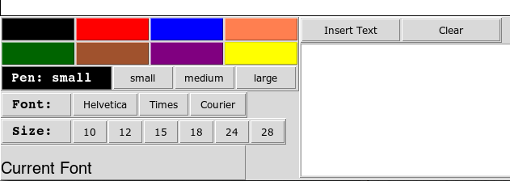

# Using snoods - a simple shared whiteboard app 

## Creating a tunnel from the client to the server

You typically don't want to the run the client on the same machine as
the server (unless the server is your workstation), because performance
will be much better if you run the client on your own workstation or
laptop.  To run remotely, you first need to create an ssh tunnel between
a port on your workstation and the machine hosting the server.
If the server is $SERVERNAME:

    ssh -L 6540:localhost:6540 $SERVERNAME

This opens an SSH connection to $SERVERNAME and tunnels port 6540 (the
default snoods port) to the same port on $SERVERNAME

## Control buttons

To exit __snoods__, click the exit button at the top left of the window.

## Basic operations

To draw on the whiteboard, drag the pen, using the middle mouse button.

To move an object (either a drawing or text) on the whiteboard,
drag the object using the left mouse button.

To change the color of an object on the whiteboard, select a new
pen color (from the pallete in the control panel, described below)
and then right-click on the object.

To erase an object from the whiteboard,
hold down the Shift key
and left-click on the object.

## The control panel

After you start __snoods__, you should see the control panel
at the lower left of the __snoods__ window:

If you don't see this control panel, or the bottom part of it
is missing, then you might need to run __snoods__ with
a smaller whiteboard size (in order to ensure that it can
fit on your screen).

The colored rectangles at the top left select the current pen color,
which is used for new text or drawings.  (You can also change the
color of existing text or drawings.)  Clicking the left mouse button
on one of these rectangles changes the pen to the corresponding color.

The current color is always displayed in the rectangle labeled "Pen:",
which is below the color selection rectangles.  This rectangle also
shows the current pen size, used for drawings.  You can change the pen
size by clicking on the small, medium, or large buttons to the right of
this rectangle.

Below the pen size, there are two rows of buttons for selecting the
text size and font.  Below these buttons is an area that displays 
the string "Current Font" written in the current font.

To add text, select the white area to the right of the control panel,
and type or paste whatever text you want.  To add it to the whiteboard,
left-click on the "Insert Text" button.  It will appear on the
whiteboard in the lower left corner, and then can be dragged to wherever
you want it to be.

To clear the text area, press the "Clear" button.

